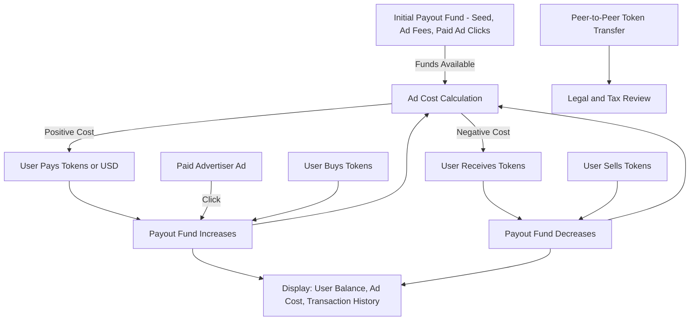

# Product Requirements Document (PRD)

## Project: Parts Pile

---

## 1. Overview

Parts Pile is a web-based platform for listing, searching, and managing automotive parts ads. It provides a structured, vehicle-centric approach to cataloging parts, allowing users to filter and search by make, year, model, engine, category, and subcategory. The system is backed by a normalized vehicle/parts database and supports CRUD operations for ads, as well as a rich vehicle data model. The platform serves both sellers (listing parts) and buyers (searching for parts).

---

## 2. Goals & Objectives

- Enable users to list and manage ads for automotive parts with detailed vehicle fitment data.
- Provide powerful, structured search and filtering by vehicle (make, year, model, engine) and part (category, subcategory).
- Support a modern, responsive UI for ad creation, editing, and browsing.
- Maintain a comprehensive, normalized database of vehicles and parts.
- Allow for future extensibility (e.g., more part attributes, user accounts, messaging).

---

## 3. Features

### 3.1 Ad Management
- Users can create, edit, and delete ads for automotive parts.
- Each ad includes: description, price, vehicle fitment (make, year(s), model(s), engine(s)), part category, and subcategory.
- Ads are timestamped.

### 3.2 Vehicle Data Integration
- The system maintains a comprehensive, normalized vehicle database (make, year, model, engine) to support accurate fitment and filtering.

### 3.3 Part Categorization
- Parts are organized by category and subcategory (e.g., "Electrical" > "Alternator").
- Categories and subcategories are stored in the database and can be extended.

### 3.4 Search & Filtering (Updated)
- Search and ad discovery are powered by semantic vector embeddings using Google Gemini (gemini-embedding-001) and Qdrant vector database.
- Each ad is encoded as a vector embedding at creation or update, stored in Qdrant with metadata (created_at, click_count, parent_company, parent_company_country, etc.).
- **Enhanced Brand Clustering:** Embeddings include parent company name and country information to improve clustering of related automotive brands (e.g., Ford/Mercury, Toyota/Lexus, Honda/Acura). This ensures ads for makes with the same parent company are semantically grouped together for better search relevance.
- **Parent Company Integration:** The system maintains a simplified parent company relationship where each make has one primary parent company (chosen for historical significance rather than current ownership). This enables better semantic understanding and brand clustering in vector embeddings.
- **Vector Search Metadata:** Each ad embedding includes comprehensive metadata for filtering and navigation:
  - **Tree Navigation Fields:** make, years (array), models (array), engines (array), category, subcategory
  - **Pricing:** price (for filtering/sorting)
  - **Geographic:** geo coordinates (lat/lon) when available
  - **Engagement:** click_count, created_at
  - **Brand Information:** parent_company, parent_company_country
- **Vector Search Filtering:** The system supports sophisticated filtering at the Qdrant vector database level:
  - **Tree Navigation Filtering:** Filter by make, year, model, engine, category, subcategory using exact matches
  - **Price Range Filtering:** Filter by price ranges (implemented via metadata)
  - **Geographic Filtering:** Filter by location/radius (placeholder implementation)
  - **Combined Filters:** Multiple filters can be applied simultaneously using Qdrant's filter system
- **Search Flow:**
  - If a user enters a query (`q`), the query is embedded and Qdrant is used to find the most semantically similar ads.
  - If a user is logged in and `q` is empty, a personalized embedding is generated by aggregating embeddings from their recent search queries, clicked ads, and bookmarked ads (bookmarks weighted most heavily). This user embedding is stored in the database and updated after every search. Qdrant is queried with this user embedding for a personalized feed.
  - If not logged in and `q` is empty, the feed is built using a combination of recency, click count, and embedding-based diversity (e.g., cluster sampling or diversity maximization in embedding space).
- **Tree View Integration:** The tree navigation system uses vector search with filters to populate tree nodes, ensuring semantic relevance while maintaining structured navigation.
- Results are ranked by vector similarity, with recency and popularity as secondary factors.
- **Infinite scroll and pagination:**
  - The system supports infinite scroll for ad results using Qdrant's offset-based pagination for consistent results across pages.
  - Pagination uses a simple cursor format (base64-encoded offset) that tracks the current position in the result set.
  - This ensures that new ads added between page loads don't cause duplicates or gaps in the results.
- All search and feed functionality is powered by Qdrant vector search only.
- **[Complete]** All vector embedding and personalization features are implemented, including persistent user embeddings and automatic updates after user activity.

### 3.5 API Endpoints
- RESTful endpoints for CRUD operations on ads and for fetching vehicle/part data for dynamic forms.

### 3.6 Modern UI/UX
- Modern, accessible web UI using Tailwind CSS and HTMX for dynamic updates.
- Form validation and user feedback for all actions.
- **Ad timestamps are displayed in the user's local timezone, using browser-provided timezone information when available.**
- On "Create New Ad" page, the current ad cost is displayed and updates dynamically as the user selects make/model/category.
  - Green if it's a payout (user receives tokens).
  - Red if it's an expense (user pays tokens).
- User's token balance is shown in the navigation bar on all pages, and is clickable for exchange and transaction history.
- UI elements that require authentication (such as "New Ad", "Edit Ad", or "Delete Ad" buttons) are shown in a disabled state or with limited interactivity for unauthenticated users, providing clear feedback that login is required to access these features.

### 3.6a In-Place Ad Card Expand/Collapse (SPA-like UX)
- Users can expand an ad card in-place to view ad details without leaving the list or tree view.
- Clicking "Expand" on an ad card loads the ad detail view in-place using htmx, replacing the card with the detail partial.
- The detail view includes a "Collapse" button to return to the original card view in-place.
- No full page reload or navigation is required; browser back/forward preserves the previous state.
- This is implemented using htmx and Gomponents, with no custom JavaScript.
- New endpoints:
  - `GET /ad/card/:id` — Returns the ad card partial for in-place collapse.
  - `GET /ad/detail/:id` — Returns the ad detail partial for in-place expand.
- This provides a seamless, SPA-like user experience while maintaining server-side rendering and progressive enhancement.

### 3.6b Ad Click Count Tracking
- Each ad tracks the number of times it has been viewed (clicked) by users, and the date/time of the last click.
- The click count and last clicked date/time are displayed on the ad card and detail views in the UI.
- Clicks are incremented in the database each time an ad is viewed.
- User-specific click tracking is also supported, allowing for analytics on unique user engagement, including the date/time of the last click by that user.

### 3.7 Ad Cost, Token Economy, and Incentives
- Posting an ad incurs a cost, which can be positive (user pays) or negative (user receives payout).
- Cost is determined by:
  - Funds available in the payout account.
  - Dynamic weighting based on ad's vehicle make/model/category and ad density (rarer = higher payout).
  - System encourages adoption by paying users to post in underrepresented areas.
- Payouts start high (e.g., 5 tokens/ad), decrease as fund depletes or ad density increases.
- **Min/Max:** Users never pay more than 5 tokens, never receive more than 5 tokens per ad.
- If the payout fund is depleted, users can still post ads, but must pay (ad cost becomes positive).
- Payout fund sources:
  - Initial seed (e.g., 1M tokens from investors).
  - Portion of positive ad costs (when users pay to post).
  - Portion of paid ad clicks (from advertisers).
- **Token System:**
  - Internal, stablecoin-like (1 token ≈ $1).
  - Users can buy tokens directly (USD, Stripe/PayPal, etc.), or receive tokens as payouts.
  - All transactions (including direct USD payments) are recorded as token transactions for transparency and account activity.
  - Users can transfer tokens to each other (e.g., for peer-to-peer payments).
  - Users can cash out surplus tokens.
  - Token balance is shown on the home page, with a link to the exchange page.
  - Tokens may be used for payment for items in ads (see legal note below).
- **Legal/Tax Note:**
  - The use of tokens as a medium of exchange between users may have legal and tax implications, including but not limited to money transmission laws, KYC/AML requirements, and sales tax collection. Further legal review is required before launch.

### 3.8 Paid Advertising & Promotion
- Advertisers pay for prominent placement in search results.
- Paid ads are visually distinct (special background).
- The first paid ad always appears at the top of search results; additional paid ads are interleaved at pagination boundaries (e.g., after each page of results).
- Clicks on paid ads charge the advertiser; a portion of this charge is contributed to the payout fund.
- Paid ads are intermixed with regular ads, but clearly marked.

### 3.9 LLM-based Username Moderation
- During user registration, the system uses a Large Language Model (LLM) to check the proposed username for appropriateness.
- The LLM evaluates whether the username is offensive, hateful, or inappropriate for a public site.
- Car-guy humor, puns, and light-hearted jokes are allowed, but anything that would be considered offensive, hateful, or discriminatory in a public forum is not allowed.
- If the username is not allowed, the LLM provides a brief explanation; if allowed, registration proceeds.
- This moderation step is in addition to uniqueness checks (e.g., no duplicate usernames).

### 3.10 User Registration & Authentication
- **Registration Requirements:**
  - Users must provide:
    - **Username** (must be unique, subject to LLM moderation for appropriateness; see 3.9)
    - **Phone number** (must be unique, used for account recovery and verification)
    - **Password** (stored securely using strong hashing, e.g., bcrypt)
  - Registration form validates all fields are present and unique.
  - Usernames are checked by an LLM for appropriateness (car-guy humor allowed, but offensive/inappropriate names are rejected with a clear message).

- **Login Requirements:**
  - Users log in with their **username** and **password**.
  - On successful login, a secure session is established (e.g., via a session cookie).
  - Incorrect username or password results in a generic error message (do not reveal which field is incorrect).

- **Logout:**
  - Users can log out, which clears their session.
  - **Logout is performed via a POST form (not a GET link), following security best practices.**

- **Security:**
  - Passwords are never stored in plain text.
  - Passwords are hashed using Argon2id with a unique salt before being stored in the database.
  - Session management is handled via an HTTP-only cookie that stores the user's `user_id` upon successful login. This cookie is used to authenticate the user for subsequent requests.
  - Phone numbers are not displayed publicly.
  - Session cookies are HTTP-only to prevent access from client-side scripts.

### 3.11 User Settings & Account Management
- Authenticated users can access a dedicated settings page (via a gear icon in the navigation bar) to manage their account.
- The settings page allows users to:
  - Change their password (current password required for confirmation).
  - Delete their account (with confirmation prompt).
- The settings page is accessible only to logged-in users.
- UI/UX: The gear icon is shown in the user navigation bar on all pages when logged in.
- **Account Deletion:**
  - When a user deletes their account:
    - User data is archived (not deleted) for historical record keeping
    - All user's ads are archived (not deleted)
    - User's token transactions are marked as involving a deleted user
    - The user and their ads are no longer visible in the main application
    - This action is irreversible and requires password confirmation

### 3.12 Data Archiving & Admin Interface
- **Data Archiving:**
  - Deleted user data is preserved in archive tables for historical records
  - Archive tables maintain the same structure as live tables, with additional deletion timestamps
  - Archived data includes:
    - User profiles (UserDead table)
    - User's ads (AdDead table)
    - Ad-car relationships (AdCarDead table)
    - Token transactions (marked with user_deleted flag)
  - This preserves data for auditing while removing it from active use

- **Admin Interface:**
  - Administrators can access archived data through dedicated endpoints
  - Admin features include:
    - View archived users with deletion dates
    - View archived ads for any deleted user
    - Search archived data by various criteria
    - Export archived data for analysis
    - View token transaction history, including deleted users
  - Admin access is restricted by role-based authentication

### 3.13 Ad Card UX (2024-06-xx)
- All ad card views (list, grid, tree, bookmarks, etc.) show a bookmark icon on each card.
- The bookmark icon is always visible and is the only clickable area that does not navigate to the ad detail page.
- Clicking anywhere else on the ad card navigates to the ad detail page (`/ad/{id}`).
- There are no expand/collapse icons or in-place expansion; ad details are shown on a separate page.

### 3.14 Ad Editing
- Ad editing is now performed inline within the ad detail view.
- The edit icon (using /edit.svg) appears on the ad detail view only for the ad owner when logged in.
- Clicking the edit icon swaps the ad detail for an inline edit form.
- The edit form has an 'X' button to cancel (return to detail view) and a Save button to save changes and return to detail view.
- There is no longer a standalone edit page or edit link.

### 3.15 Ad Location
- Each ad now has an optional location field to track where parts are located. This field is stored in the database and can be set or edited by the user. If present, it is displayed on the ad details page.
- **Grok API Location Resolution:** When users enter location information (address, city, zip code, or country), the system uses the Grok API to intelligently resolve and standardize the location data:
  - **Structured Location Data:** Grok translates user input into standardized city, admin_area (state/province), and country fields
  - **Geographic Coordinates:** Grok also provides latitude and longitude coordinates for the resolved location
  - **Database Storage:** Location data is stored in the Location table with coordinates for future geographic search capabilities
  - **Vector Metadata:** Coordinates are included in vector embeddings for geographic filtering and proximity-based search
  - **Country Code Standardization:** Countries are stored as 2-letter ISO codes (e.g., "US", "CA", "GB") for consistency
  - **Admin Area Formatting:** US and Canadian states/provinces use official 2-letter codes (e.g., "OR", "NY", "BC", "ON"), while other countries use full names

---

## 4. Technology Stack

The platform is built with the following technologies:

- **Backend:** Written in Go, using the [Fiber](https://gofiber.io/) web framework for high performance. Fiber handles routing, middleware, sessions, authentication, and request/response logic.
- **HTML Generation:** Uses Gomponents for type-safe, composable UI components in Go.
- **Frontend:** Tailwind CSS and HTMX for responsive, dynamic user interfaces.
- **Vector Search:** Google Gemini (gemini-embedding-001) for semantic embeddings and Qdrant vector database for similarity search and filtering.
- **Database:** SQLite with comprehensive schema for vehicle data, user management, and transaction tracking.
- **Background Processing:** Go goroutines for vector embedding generation and user personalization updates.

---

## 5. User Stories

- As a seller, I want to create a new ad for a part, specifying the exact vehicles it fits, so buyers can find it easily.
- As a buyer, I want to search for parts by my car's make, year, model, and engine, so I only see relevant ads.
- As a user, I want to browse categories and subcategories to discover available parts.
- As a seller, I want to edit or delete my ads if details change or the part is sold.
- As a user, I want fast, accurate search results and a modern, easy-to-use interface.
- As a user, I want to manage my account settings, including changing my password or deleting my account, from a dedicated settings page.

---

## 6. Data Model (Simplified)

### Live Tables
- **Make**: id, name, parent_company_id
- **ParentCompany**: id, name, country
- **Year**: id, year
- **Model**: id, name
- **Engine**: id, name
- **Car**: id, make_id, year_id, model_id, engine_id
- **PartCategory**: id, name
- **PartSubCategory**: id, category_id, name
- **Location**: id, raw_text, city, admin_area, country, latitude, longitude
- **Ad**: id, description, price, created_at, subcategory_id, user_id, location_id, has_vector
- **AdCar**: ad_id, car_id
- **User**: id, name, phone, token_balance, password_hash, created_at
- **TokenTransaction**: id, user_id, type, amount, related_user_id, ad_id, created_at, description, user_deleted
- **UserSearch**: id, user_id (nullable), query_string, created_at
- **PayoutFund**: id, balance, updated_at
- **UserEmbedding**: id, user_id, embedding (blob), updated_at

### Vector Database (Qdrant)
- **Ad Embeddings**: Stored with comprehensive metadata including:
  - Tree navigation fields (make, years, models, engines, category, subcategory)
  - Pricing information (price)
  - Geographic coordinates (lat/lon) when available
  - Engagement metrics (click_count, created_at)
  - Brand information (parent_company, parent_company_country)

### Archive Tables
- **UserDead**: id, name, phone, token_balance, password_hash, created_at, deletion_date
- **AdDead**: id, description, price, created_at, subcategory_id, user_id, deletion_date
- **AdCarDead**: ad_id, car_id, deletion_date

See `schema.sql` for full schema and indexes.

**Note:** Archive tables maintain historical data for deleted users and their content, with deletion timestamps for auditing purposes.

---

## 7. API & Endpoints

- `GET /` — Home/search page
- `GET /new-ad` — New ad form
- `GET /edit-ad/{id}` — Edit ad form
- `GET /ad/{id}` — View ad details
- `GET /search` — Search ads (supports query and cursor for pagination)
- `GET /api/makes` — List all makes
- `GET /api/years?make=...` — List years for a make
- `GET /api/models?make=...&years=...` — List models for make/years
- `GET /api/engines?make=...&years=...&models=...` — List engines for make/years/models
- `POST /api/new-ad` — Create new ad
- `POST /api/update-ad` — Update ad
- `DELETE /delete-ad/{id}` — Delete ad
- `GET /register` — Registration form
- `POST /api/register` — Register new user
- `GET /login` — Login form
- `POST /api/login` — User login
- `POST /logout` — User logout
- `GET /settings` — User settings page (change password, delete account)
- `POST /api/change-password` — Change user password
- `POST /api/delete-account` — Delete user account

### Admin Endpoints
- `GET /admin/archived/users` — List archived users
- `GET /admin/archived/users/{id}` — View specific archived user
- `GET /admin/archived/users/{id}/ads` — View archived ads for user
- `GET /admin/archived/search` — Search archived data
- `GET /admin/archived/transactions` — View token transactions (including deleted users)
- `GET /admin/archived/export` — Export archived data (CSV/JSON)

---

## 8. Non-Functional Requirements

- **Performance**: Fast search and filtering, efficient DB queries, indexed tables.
- **Scalability**: Designed for extensibility (e.g., user accounts, more part attributes).
- **Security**: Input validation, confirmation for destructive actions.
- **Reliability**: Transactional DB operations for ad CRUD.
- **Maintainability**: Modular Go codebase, clear separation of concerns.
- **Accessibility**: Responsive, accessible UI components.

---

## 9. Licensing

- BSD 3-Clause License (see LICENSE file)

---

## 10. Open Questions / Future Work

- User authentication and account management
- Messaging between buyers and sellers
- Image uploads for ads
- Advanced analytics and reporting
- Internationalization/localization
- Admin dashboard for moderation
- Ongoing review of the sustainability model for the payout fund
- Ongoing legal and compliance review for token use, exchange, and peer-to-peer payments

---

## 11. Ad Cost Calculation & Payout Fund Drawdown
- **Formula for Ad Cost:**
  - Ad cost = base_payout × exp(-λ × total_ads) × fund_factor × weight_factor
    - base_payout: 5 tokens (max payout)
    - λ: decay constant, controls how quickly payout drops as ads accumulate
    - total_ads: total number of ads posted
    - fund_factor: function of current fund size (e.g., payout halves when fund halves)
    - weight_factor: dynamically calculated, higher for rare makes/categories (e.g., inverse of ad count for that make/category)
  - Payout is capped: never more than 5 tokens, never less than -5 tokens (user pays max 5 tokens).
  - If fund = 0, payout is negative (user pays to post).
- **Sustainability Model:**
  - The system is designed to be self-sustaining, with the payout fund replenished by ad posting fees and paid ad clicks.
  - If the fund is depleted, the system continues to operate with users paying to post ads, but the goal is to maintain a positive fund balance to incentivize adoption.

## 12. Legal & Compliance
- **Token Use and Exchange:**
  - The use of tokens as a medium of exchange between users, and the ability to cash out tokens, may trigger regulatory requirements (e.g., money transmission, KYC/AML, tax reporting).
  - Legal review and compliance measures are required before enabling peer-to-peer token transfers and cash-out functionality.
  - The system will record all token transactions for transparency and auditability.

## 13. Token and Fund Flow Diagram

---

## Database Rebuild Command

A new command in `cmd/rebuild_db/` will:
- Delete any existing `project.db`.
- Create a new `project.db` using the schema in `schema.sql`.
- Import vehicle data from `make-year-model.json`.
- Import part category/subcategory data from `part.json` (now located in `cmd/rebuild_db/`).

This command ensures the database is always rebuilt from a clean slate and is idempotent. 